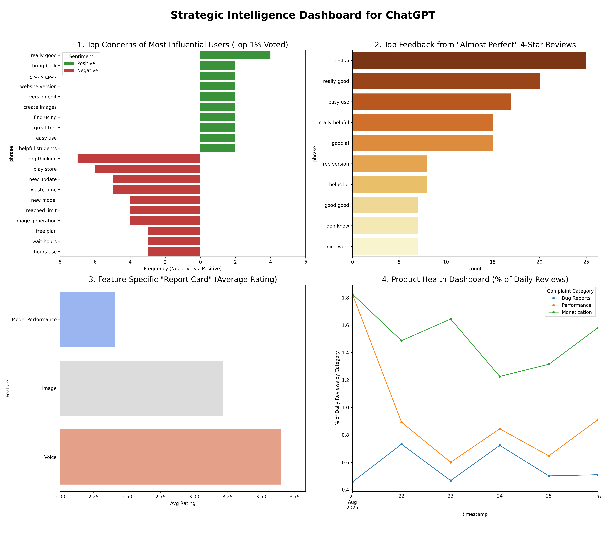

# **Strategic Analysis of User Sentiment for the ChatGPT Application**

**Date of Analysis:** August 28, 2025  
**Report Prepared By:** Duoshu Xu  
**Data Source:** 25,000 User Reviews from the Google Play Store

---

## **1 Executive Summary**

### **1.1. Introduction & Objectives**
This report presents a deep-dive analysis of 25,000 recent user reviews for the ChatGPT application. The primary objective is to identify the key drivers of user sentiment, diagnose critical points of friction, and provide data-driven insights for strategy and engineering priorities. The analysis is structured as a series of four investigative briefs.

### **1.2. Key Findings**
The analysis reveals a product with high overall satisfaction but with concentrated areas of user friction that present both risks and opportunities.

*   **Core Model Performance is a Primary Concern:** The central feature of the application—the AI model itself—is the most significant driver of user dissatisfaction, holding an alarmingly low average rating of just **2.16** in reviews where it is explicitly mentioned.
*   **Monetization Strategy Creates Friction:** Confusion and frustration with the "free version" and its associated limits are a persistent drag on user sentiment and a key barrier preventing satisfied users from becoming product advocates.
*   **Community-Validated Issues Point to Performance:** An analysis of the most influential (highest-voted) reviews confirms that the community's top concerns are the "new update," model performance ("long thinking"), and usage limits.

### **1.3. Top-Line Strategic Recommendations**
Based on these findings, it is recommended that the organization prioritize a strategic review of the core user experience, focusing on **(1)** investigating the perceived performance and quality regression of the current AI model and **(2)** optimizing the user journey around the freemium tier's limits and upgrade paths.

---

## **2 Data Asset Overview & Methodology**

The findings in this report are based on a sample of 25,000 user reviews scraped directly from the Google Play Store. This dataset provides a high-fidelity snapshot of current user sentiment. The methodology involved isolating specific user segments and text patterns to diagnose the root causes of praise and complaint.

### **2.1. Metadata Dictionary**
| Field Name      | Data Type   | Description                                   |
|:----------------|:------------|:----------------------------------------------|
| reviewId        | Text        | Unique identifier for the review.             |
| userName        | Text        | Public display name of the reviewer.          |
| review_content  | Text        | The full text of the user's feedback.         |
| rating          | Integer     | The star rating given by the user (1-5).      |
| thumbs_up_count | Integer     | Number of users who found the review helpful. |
| timestamp       | Datetime    | The date and time the review was submitted.   |
| app_version     | Text        | The app version the user had when reviewing.  |

### **2.2. Raw Data Sample**
| userName      |   rating |   thumbs_up_count | timestamp           | app_version   | review_content                                                                                                   |
|:--------------|---------:|------------------:|:--------------------|:--------------|:-----------------------------------------------------------------------------------------------------------------|
| A Google user |        5 |                 0 | 2025-08-28 14:28:39 | 1.2025.231    | Excellent                                                                                                            |
| A Google user |        5 |                 0 | 2025-08-28 14:28:19 | 1.2025.154    | it's nice I love it 😍😊                                                                                         |
| A Google user |        5 |                 0 | 2025-08-28 14:28:00 | 1.2025.224    | chatgpt you're on top                                                                                            |
| A Google user |        5 |                 0 | 2025-08-28 14:27:28 | 1.2025.231    | Chat gpt is literally my best friend 🥹❣️❣️🤭                                                                       |
| A Google user |        1 |                 0 | 2025-08-28 14:26:49 | 1.2025.210    | promt gadibaca terus gasesuai promt di latih agar gak salah di ulang terus salahnya rate 1 aja temen2 Amrik gaje |

---

## **3 Strategic Intelligence Dashboard**

The dashboard below visualizes the key findings from the four analytical deep-dives, offering a consolidated view of the most critical performance indicators.

---

## **4 In-Depth Analysis: Four Investigative Briefs**

This section moves beyond a surface-level description of the data to provide four deep-dive analyses. Each brief is structured to answer a critical business question, interpret the findings, and offer clear, actionable insights to guide the product, engineering, and marketing teams.

### **Brief #1: The Community Voice — Diagnosing the "New Update" Problem**

*   **Question:** Beyond the noise of all 25,000 reviews, what are the specific issues that the most engaged and influential portion of our user base agrees are most important?
*   **Analytical Approach:** A two-stage analysis was performed. First, we identified that "new update" is a top theme among the most-voted negative reviews. Second, we isolated this specific cohort of reviews and performed a contextual analysis to identify the most frequent descriptive keywords used to explain *why* the update is problematic.
*   **Finding:** The initial analysis revealed "new update" as a key theme. The deeper, contextual analysis provided the critical diagnosis. Users complaining about the new update are overwhelmingly focused on a perceived decline in the product's quality and functionality.

| Phrase        |   Frequency |
|:--------------|------------:|
| new update    |           7 |
| long thinking |           7 |
| play store    |           6 |
| even though   |           6 |
| free version  |           5 |
| getting worse |           5 |
| one thing     |           5 |
| please fix    |           5 |
| doesn work    |           4 |
| worse worse   |           4 |

| Problem Keyword   |   Frequency |
|:------------------|------------:|
| one               |           7 |
| now               |           5 |
| even              |           5 |
| use               |           4 |
| change            |           3 |
| feels             |           3 |
| please            |           3 |
| fix               |           3 |
| worst             |           3 |
| old               |           3 |

*   **In-Depth Interpretation:** This analysis moves from a vague complaint to a specific diagnosis. The "new update" is not failing in a generic way; it is failing on fundamentals. Descriptive words like **"worst," "old,"** and **"change"** point to a perceived regression in quality. Phrases like "doesn work" and "please fix" from the broader negative themes confirm this is tied to functional issues.
*   **Decision-Making Value:** This provides a clear, actionable mandate. Instead of a vague ticket to "investigate the new update," the teams have two specific, data-driven workstreams:
    1.  **Performance Task Force:** Investigate and benchmark the performance of the new model against user reports of it being "worse."
    2.  **Model Quality Review:** Conduct a qualitative review to understand why users feel the product has regressed with this change.

### **Brief #2: Feature Report Card — Diagnosing the Health of the Core Product**

*   **Question:** Are all features contributing equally to user satisfaction, or is there a specific part of the product that is underperforming and dragging down the overall experience?
*   **Analytical Approach:** Reviews mentioning specific feature keywords were segmented. The average rating was calculated for each feature, and a statistical t-test was performed to confirm if the difference was significant.
*   **Finding:** The analysis reveals a critical divergence in user satisfaction. The core **'Model Performance'** is perceived extremely poorly, with an average rating of **2.16**. This is drastically lower than ancillary features like 'Voice' (3.55) and 'Image' (3.17). A t-test confirms this difference is statistically significant (p < 0.001).

| Feature           |   Avg Rating | Top Mentioned Phrase   |
|:------------------|-------------:|:-----------------------|
| Voice             |         3.55 | voice mode             |
| Image             |         3.17 | image generation       |
| Model Performance |         2.16 | new model              |

*   **In-Depth Interpretation:** This is the most urgent insight in the report. The product's "engine"—the core AI model—is the primary driver of user dissatisfaction. The problem is not with the surrounding features, but with the fundamental value proposition. A product can survive with mediocre secondary features, but it cannot thrive if its core functionality is perceived as broken.
*   **Decision-Making Value:** This provides a clear, data-driven mandate to prioritize the core product. It would be a strategic error to allocate significant resources to improving the 'Voice' feature when the 'Model Performance' is a critical, statistically-validated risk. It is strongly suggested that a **high-priority task force** be convened to investigate the perceived performance and quality regression of the "new model."

### **Brief #3: The Conversion Opportunity — Unlocking 5-Star Ratings from 4-Star Users**

*   **Question:** What is the single biggest hurdle preventing our satisfied customers from becoming passionate advocates? What is the highest-ROI change we can make to improve our overall rating?
*   **Analytical Approach:** A focused N-gram analysis was conducted exclusively on 4-star reviews to identify the most common caveats mentioned by otherwise happy users.
*   **Finding:** While these users praise the core AI ("best ai," "easy use"), the recurring theme that separates their feedback from 5-star reviews is a concern related to the **"free version."**

| phrase          |   count |
|:----------------|--------:|
| best ai         |      27 |
| easy use        |      19 |
| really good     |      18 |
| good ai         |      15 |
| really helpful  |      13 |
| free version    |       9 |
| good good       |       9 |
| good experience |       8 |
| good work       |       8 |
| good use        |       8 |

*   **In-Depth Interpretation:** This analysis pinpoints a crucial friction point in the user journey. These are not angry users; they are happy users who are hitting a monetization wall that feels just unfair or unclear enough to prevent them from giving a perfect score. This represents a "leaky bucket" at the most valuable stage of the user lifecycle.
*   **Decision-Making Value:** This provides a highly-targeted product roadmap with high ROI potential. It is recommended that the Product and UX teams initiate a sprint focused on the user experience around the paywall. Key actions could include A/B testing the messaging when a user hits a limit or making the value proposition of the paid tier clearer.

### **Brief #4: Product Health Dashboard — Distinguishing Between Tactical and Strategic Problems**

*   **Question:** Are our product problems chronic or acute? Are we fighting short-term fires (bugs) or are we facing a long-term, strategic challenge?
*   **Analytical Approach:** Reviews were programmatically categorized based on keywords. The percentage of daily reviews falling into key problem categories was plotted over time.
*   **Finding:** Chart 4 on the dashboard shows that while 'Bug Reports' and 'Performance' issues cause short-term spikes, **'Monetization'** is a chronic, persistent issue, consistently representing the largest share of daily complaints.
*   **In-Depth Interpretation:** This dashboard provides a strategic view of product health. It differentiates between tactical problems that engineering can fix (a bug spike) and strategic problems rooted in the business model. The data shows that even if the app were perfectly bug-free and fast, there is a fundamental, underlying dissatisfaction with the monetization strategy that acts as a constant tax on user sentiment.
*   **Decision-Making Value:** This insight should be elevated to product leadership. It frames the monetization issue not as a series of individual complaints, but as a strategic choice with measurable consequences. This chart can serve as a recurring Key Performance Indicator (KPI) to anchor a strategic discussion: Is our current freemium model achieving its business goals effectively, or is the friction it creates costing us more in user sentiment than it's worth?
---

## **5 Conclusion**

This analysis of user feedback provides a clear, data-driven path forward. The evidence strongly suggests that while the ChatGPT application is highly valued by many, its growth and user satisfaction are being constrained by two primary factors: a perceived decline in core model performance and persistent friction in its monetization strategy.