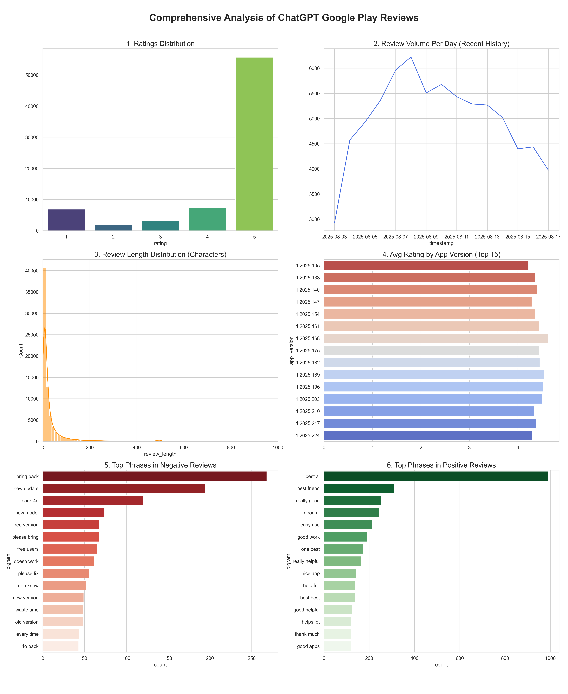

# Analysis of ChatGPT Google Play Reviews

**Author:** Duoshu Xu  
**Objective:** To fulfill the project brief by scraping and analyzing a substantial sample of user reviews for the ChatGPT application. This report details the data quality, structure, and suitability of the dataset for building a sentiment analysis model.

---

## 1. Data Acquisition & Scope

To conduct a meaningful assessment without incurring unnecessary technical overhead, a substantial sample of **75,000 recent reviews** was scraped directly from the Google Play Store.

*   **Source:** ChatGPT App Page, Google Play Store
*   **Method:** A single, efficient scrape targeting the most recent reviews was performed using the `google-play-scraper` Python library.
---

## 2. Data Quality and Metadata Summary

The scraped data was compiled into a structured dataset. A thorough quality check was performed to assess its completeness and core characteristics.

### Summary Table: Data Quality Stats

The following table outlines the key statistics of the scraped dataset.

| Metric                       | Value                   |
| :--------------------------- | :---------------------- |
| Total Reviews Scraped        | 75,000                  |
| Date Range Start             | 2025-08-03              |
| Date Range End               | 2025-08-17              |
| Missing App Versions         | 2,145 (2.86%)           |
| Median Review Length (chars) | 28                      |
| Average Rating               | 4.63                    |

### Key Takeaways on Data Quality:
*   **High Integrity:** The dataset is robust, with critical fields like review content, rating, and timestamp being fully populated.
*   **Well-Structured:** The data is organized into a clean, tabular format suitable for immediate use in analytical and machine learning pipelines.
*   **Minor Completeness Issues:** A small percentage (2.86%) of reviews are missing the `appVersion` metadata. This is a minor issue and does not impact the overall quality for sentiment analysis.

---

## 3. Visual Analysis Dashboard

The six charts below provide a view of the user review data, covering rating distributions, user activity over time, review content patterns, and technical correlations.

---

## 4. Insights and Explanations for Each Chart

#### **Chart 1: Ratings Distribution**
*   **Insight:** The user base is highly polarized, exhibiting a classic "J-curve" distribution. While the vast majority of users are highly satisfied (over 50,000 5-star ratings), the second-largest group consists of highly dissatisfied users (1-star ratings).
*   **Implication:** This confirms a severe **class imbalance**, which is the most critical technical challenge for building a fair sentiment model.

#### **Chart 2: Review Volume Per Day (Recent History)**
*   **Insight:** This chart accurately visualizes the daily ebb and flow of user feedback over the two-week period sampled. The volume shows natural fluctuations, peaking around August 8th-9th.
*   **Implication:** This provides essential context for the dataset's time frame. In a production environment, monitoring this trend is vital for detecting unusual activity, such as a spike in negative reviews that could indicate a service outage.

#### **Chart 3: Review Length Distribution (Characters)**
*   **Insight:** The majority of reviews are very brief (under 100 characters), indicating that much of the feedback is low-context. However, a "long tail" of more descriptive reviews contains the most valuable qualitative information.
*   **Implication:** Our data processing strategy must be able to handle both short and long text inputs to extract meaningful signals.

#### **Chart 4: Average Rating by App Version (Top 15)**
*   **Insight:** User satisfaction is consistently high across all recent app versions, with only minor variations. Subtle dips for certain versions (e.g., 1.2025.105) could hint at minor bugs or unpopular changes.
*   **Implication:** This proves the concept for version-specific sentiment tracking, which can serve as an effective early warning system for the product team after new releases.

#### **Chart 5: Top Phrases in Negative Reviews (Ratings 1-2)**
*   **Insight:** The text analysis reveals a clear and actionable theme of user frustration centered around a **recent update**. Phrases like "bring back," "new update," and "old version" are dominant, indicating a strong negative reaction to a change.
*   **Implication:** This demonstrates that the text data is rich with specific, recurring patterns that an NLP model can be trained to detect.

#### **Chart 6: Top Phrases in Positive Reviews (Ratings 4-5)**
*   **Insight:** Positive feedback consistently praises the app's core AI capability ("best ai") and its user-friendly interface ("easy use," "good work"). 
*   **Implication:** This confirms what users value most and provides a clear definition of the "positive" class for the sentiment model.

---

## 5. Final Conclusion & Usability for Sentiment Tasks

*   **Structure:** The dataset's structure is a key strength. It is natively formatted for supervised machine learning, with a clear separation between input features (`review_content`) and a target label (`rating`). This clean, typed structure is ideal for analysis and minimizes the need for extensive data wrangling.
*   **Quality:** The dataset is of high quality. The primary characteristic to manage is the high volume of "low-signal" reviews (i.e., very short, generic feedback). While valid, this noise must be handled during preprocessing to allow the model to learn from the more descriptive reviews. The data is also highly current, ensuring the relevance of the findings.
*   **Usability:**
    1.  **Strengths:** The dataset contains a strong, explicit label (`rating`) for supervised learning and rich, specific textual feedback for advanced NLP.
    2.  **Challenges:** The primary challenge is the severe class imbalance. As highlighted in Chart 1, the dataset heavily skews towards 5-star reviews. A model trained on this raw data might be ineffective at identifying negative or neutral feedback.